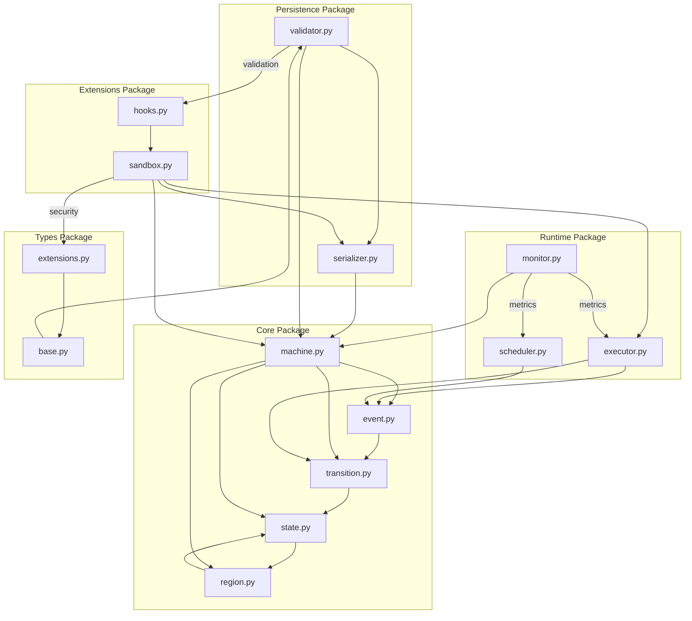
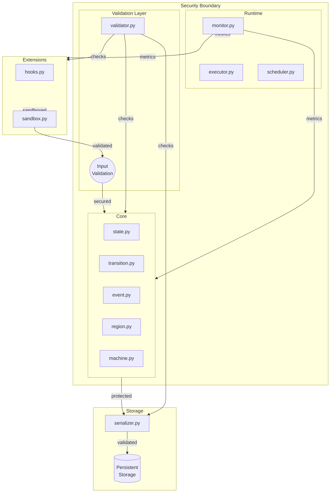
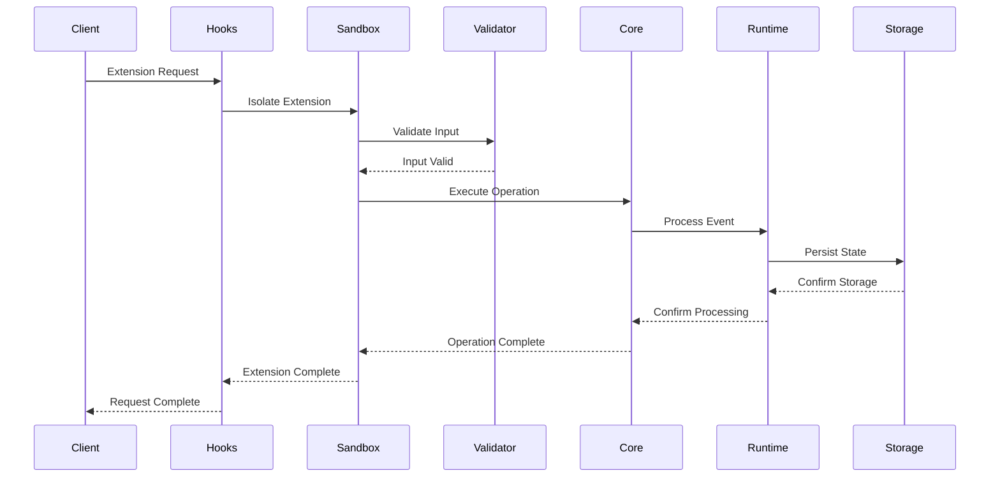

# File Level Architecture Diagrams

## Module Dependencies



## Security Boundaries



## Data Flow



## Extension Points

```mermaid
graph TB
    subgraph core[Core Extension Points]
        state[State Behavior]
        transition[Transition Logic]
        event[Event Processing]
    end

    subgraph runtime[Runtime Extension Points]
        execution[Execution Strategy]
        scheduling[Timer Management]
        monitoring[Metrics Collection]
    end

    subgraph persistence[Persistence Extension Points]
        format[Storage Format]
        validation[Validation Rules]
        migration[Version Migration]
    end

    subgraph types[Type Extension Points]
        custom[Custom Types]
        conversion[Type Conversion]
        checking[Type Validation]
    end

    hooks[Extension Hooks]
    sandbox[Extension Sandbox]

    %% Extension flow
    hooks --> |manages| sandbox
    sandbox --> |controls| state
    sandbox --> |controls| transition
    sandbox --> |controls| event
    sandbox --> |controls| execution
    sandbox --> |controls| scheduling
    sandbox --> |controls| monitoring
    sandbox --> |controls| format
    sandbox --> |controls| validation
    sandbox --> |controls| migration
    sandbox --> |controls| custom
    sandbox --> |controls| conversion
    sandbox --> |controls| checking

    %% Security
    sandbox --> |isolates| core
    sandbox --> |isolates| runtime
    sandbox --> |isolates| persistence
    sandbox --> |isolates| types
