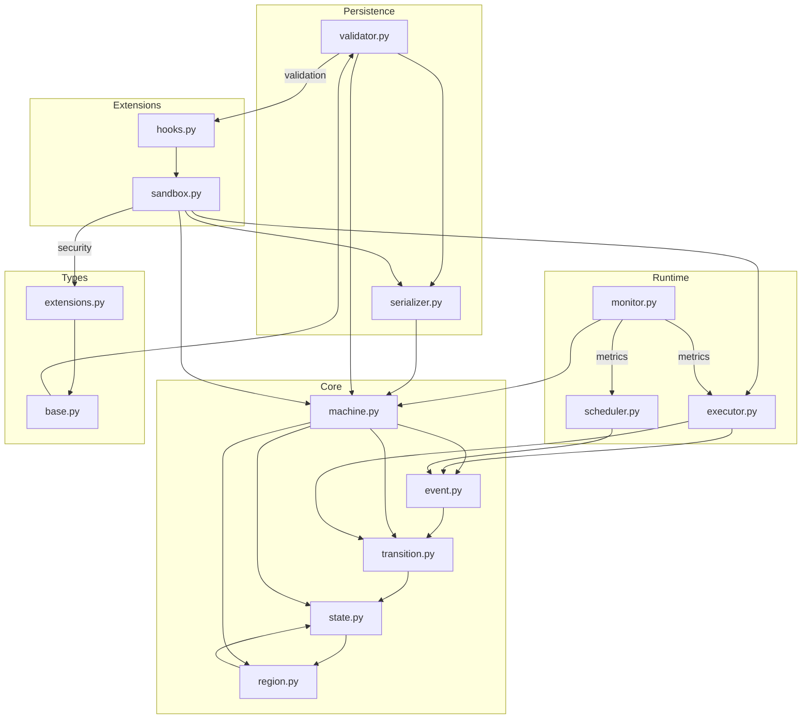

# File Level Architecture

## Module Structure

```
gotstate/
├── core/
│   ├── __init__.py           # Core package initialization
│   ├── state.py              # State class and hierarchy management
│   ├── transition.py         # Transition types and behavior
│   ├── event.py             # Event processing and queue management
│   ├── region.py            # Parallel region and concurrency
│   └── machine.py           # State machine orchestration
├── runtime/
│   ├── __init__.py          # Runtime package initialization
│   ├── executor.py          # Event execution and run-to-completion
│   ├── scheduler.py         # Time/change event scheduling
│   └── monitor.py           # State machine monitoring
├── persistence/
│   ├── __init__.py          # Persistence package initialization
│   ├── serializer.py        # State/transition serialization
│   └── validator.py         # Definition validation
├── types/
│   ├── __init__.py          # Types package initialization
│   ├── base.py              # Core type definitions
│   └── extensions.py        # Type system extensions
└── extensions/
    ├── __init__.py          # Extensions package initialization
    ├── hooks.py             # Extension points
    └── sandbox.py           # Extension isolation
```

## Cross-Module Contracts

### Core Module Contracts

1. state.py

- Provides hierarchical state management
- Maintains state data isolation
- Enforces state invariants
- Manages history state preservation
- Coordinates with region.py for parallel states

2. transition.py

- Implements transition type hierarchy
- Manages transition behavior and actions
- Resolves transition conflicts
- Coordinates with state.py for state changes
- Integrates with event.py for triggers

3. event.py

- Implements event queue management
- Handles event processing patterns
- Maintains event ordering
- Coordinates with executor.py for processing
- Integrates with scheduler.py for time events

4. region.py

- Manages parallel region execution
- Maintains region synchronization
- Handles cross-region transitions
- Coordinates with state.py for hierarchy
- Integrates with executor.py for concurrency

5. machine.py

- Orchestrates state machine lifecycle
- Manages configuration and initialization
- Coordinates all core components
- Integrates with monitor.py for introspection
- Handles dynamic modifications

### Runtime Module Contracts

1. executor.py

- Enforces run-to-completion semantics
- Manages transition execution
- Handles concurrent operations
- Coordinates with event.py for processing
- Integrates with monitor.py for metrics

2. scheduler.py

- Manages time and change events
- Maintains timer consistency
- Coordinates with event.py for queuing
- Integrates with executor.py for processing
- Handles timer interruptions

3. monitor.py

- Provides introspection capabilities
- Emits state machine events
- Tracks execution metrics
- Coordinates with all modules for monitoring
- Maintains monitoring boundaries

### Persistence Module Contracts

1. serializer.py

- Handles state machine persistence
- Preserves runtime state
- Maintains version compatibility
- Coordinates with validator.py for integrity
- Integrates with types.py for serialization

2. validator.py

- Validates state machine definitions
- Ensures semantic consistency
- Verifies transition rules
- Coordinates with all modules for validation
- Maintains validation boundaries

### Types Module Contracts

1. base.py

- Defines core type system
- Specifies type compatibility rules
- Manages type safety
- Coordinates with validator.py for checking
- Integrates with extensions.py for custom types

2. extensions.py

- Provides type system extension points
- Manages type conversions
- Maintains type consistency
- Coordinates with base.py for compatibility
- Integrates with sandbox.py for safety

### Extensions Module Contracts

1. hooks.py

- Defines extension interfaces
- Manages extension lifecycle
- Provides customization points
- Coordinates with sandbox.py for isolation
- Integrates with all modules for extension

2. sandbox.py

- Implements extension isolation
- Enforces resource boundaries
- Manages extension security
- Coordinates with hooks.py for lifecycle
- Maintains extension guarantees

## Cross-Cutting Concerns

1. Security

- Input validation at module boundaries
- State protection mechanisms
- Resource usage monitoring
- Extension sandboxing
- Type system safety

2. Error Handling

- Consistent error propagation
- State recovery mechanisms
- Extension error isolation
- Validation error reporting
- Resource exhaustion handling

3. Performance

- Efficient state transitions
- Optimized event processing
- Parallel execution management
- Resource usage optimization
- Extension performance boundaries

4. Monitoring

- State machine metrics
- Event processing statistics
- Resource usage tracking
- Extension monitoring
- Performance measurements

5. Testing

- Module-level test boundaries
- Integration test patterns
- Extension testing framework
- Performance test harness
- Security test coverage

## Design Patterns

1. Core Patterns

- Composite Pattern for state hierarchy
- Observer Pattern for state changes
- Command Pattern for transitions
- Strategy Pattern for event processing
- Mediator Pattern for coordination

2. Runtime Patterns

- State Pattern for execution
- Publisher/Subscriber for monitoring
- Factory Pattern for creation
- Builder Pattern for configuration
- Singleton Pattern for schedulers

3. Extension Patterns

- Plugin Pattern for extensions
- Proxy Pattern for sandboxing
- Adapter Pattern for type conversion
- Decorator Pattern for monitoring
- Chain of Responsibility for validation

## Module Dependencies



## Security Boundaries

1. Module Boundaries

- Strict input validation
- Type safety enforcement
- Resource usage controls
- Error isolation
- Extension sandboxing

2. Data Flow Boundaries

- State data isolation
- Event queue protection
- Transition atomicity
- Extension data separation
- Type system safety

3. Resource Boundaries

- Memory usage limits
- Thread pool management
- I/O restrictions
- Extension resource caps
- Timer constraints

## Version Management

1. Module Versioning

- Semantic versioning per module
- Compatibility matrices
- Breaking change tracking
- Migration guidance
- Extension compatibility

2. State Evolution

- State definition versioning
- Runtime state migration
- History state preservation
- Extension state handling
- Type system evolution
