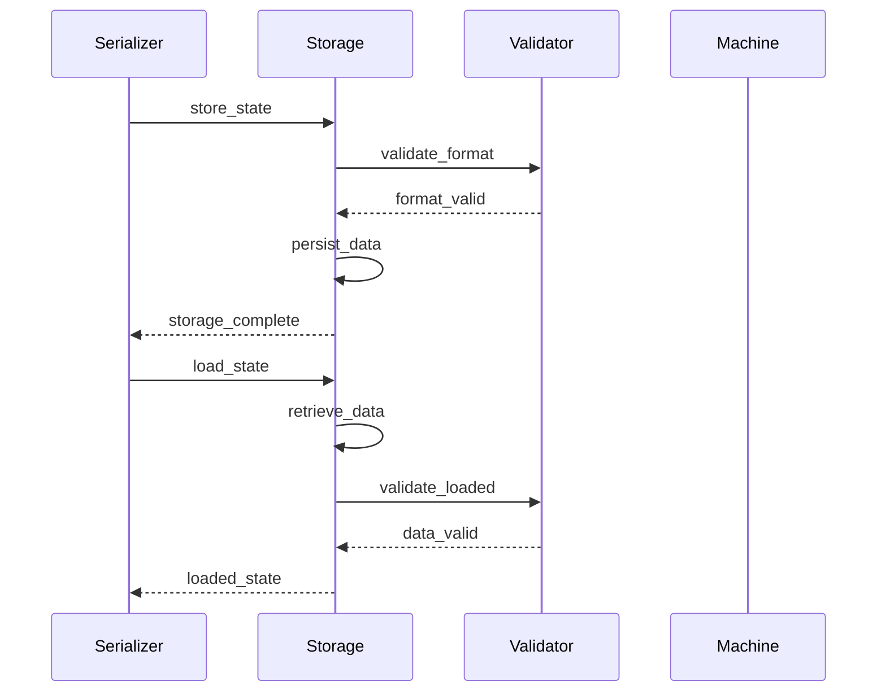
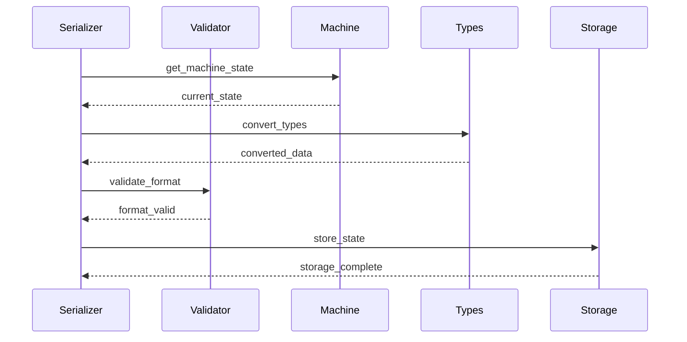
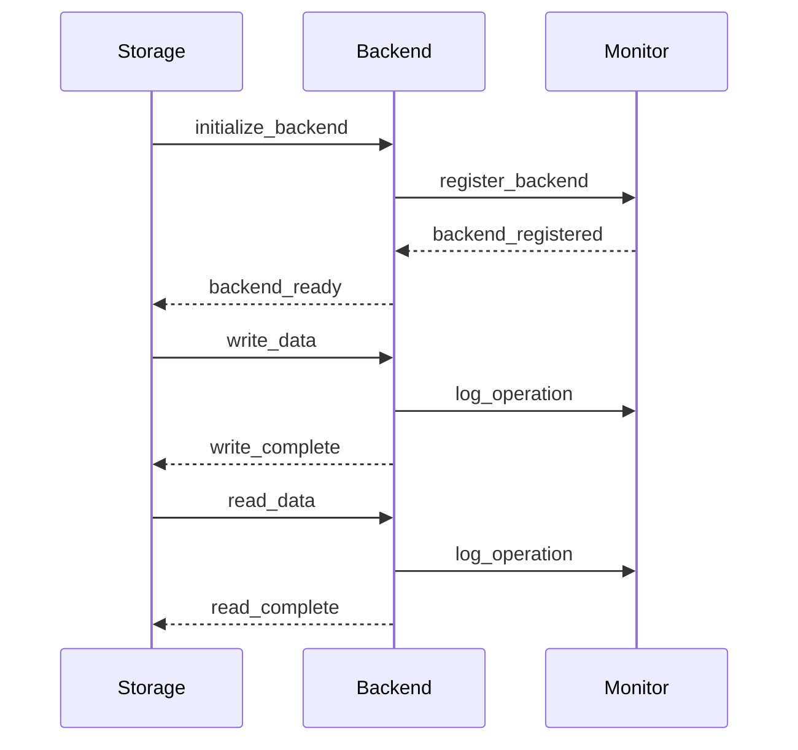

# Interaction Protocols

This document defines the concrete protocols for interactions between components at the file level.

## Core State Machine Operations

### State Entry Protocol

### Event Processing Protocol

### Parallel Region Synchronization

## Runtime Operations

### Execution Cycle Protocol

### Monitoring Protocol

## Persistence Operations

### Storage Protocol

### Serialization Protocol

### Storage Backend Protocol

### Validation Protocol

## Extension Operations

### Extension Loading Protocol

## Cross-cutting Protocols

### Error Handling Protocol

### Resource Management Protocol

## Protocol Guidelines

1. Error Handling

- All protocols must include error paths
- Error recovery should be explicit
- Error propagation must be consistent

2. Resource Management

- Resource acquisition must be explicit
- Resource release must be guaranteed
- Resource limits must be enforced

3. Thread Safety

- Synchronization points must be identified
- Lock ordering must be consistent
- Deadlock prevention must be ensured

4. Monitoring

- Key events must be tracked
- Performance metrics must be collected
- Resource usage must be monitored

5. Security

- Trust boundaries must be respected
- Validation must be comprehensive
- Isolation must be maintained
