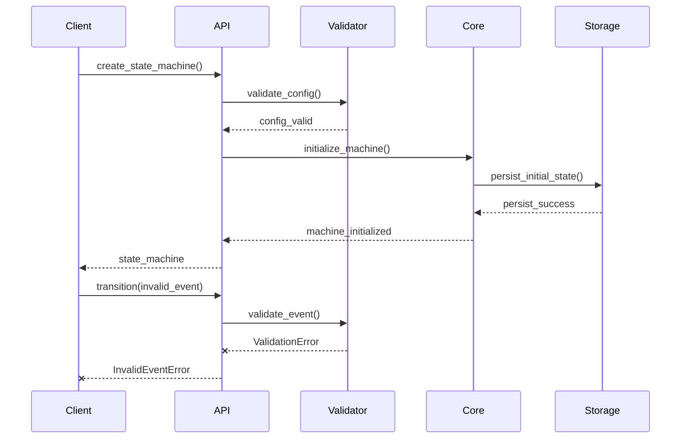

# gotstate Package API

## Package Boundaries

The gotstate package provides a stable public API for hierarchical finite state machines (HFSM) while maintaining strict security and validation boundaries.

### Security Boundaries

1. Input Validation
   - All public API inputs are validated before processing
   - Type checking through Python type system
   - Value range and format validation
   - Schema validation for configuration

2. State Protection
   - Internal state is encapsulated
   - Immutable state representations exposed
   - Controlled state modification through API only

3. Resource Boundaries
   - Configurable resource limits
   - Memory usage controls
   - Thread pool management
   - File system access restrictions

### Configuration Interface

Package-level configuration with security and validation:

```python
{
    'validation': {
        'strict_mode': True,      # Enforce UML compliance
        'runtime_checks': True    # Runtime invariant checking
    },
    'security': {
        'state_isolation': True,  # Enforce state boundaries
        'input_validation': True  # Strict input validation
    },
    'resources': {
        'max_memory': '1GB',     # Memory usage limit
        'max_threads': 4,        # Thread pool size
        'max_states': 1000       # State cache size
    },
    'storage': {
        'backend': 'file',       # Storage backend type
        'path': './data',        # Backend-specific config
        'format': 'json',        # Serialization format
        'compression': False     # Enable compression
    },
    'runtime': {
        'executor': 'thread',    # Execution model
        'scheduler': 'default',  # Scheduler implementation
        'monitor': 'basic'       # Monitoring level
    }
}
```

### Configuration Providers

The package supports multiple configuration sources:

1. Environment Variables

```bash
GOTSTATE_STORAGE_BACKEND=file
GOTSTATE_STORAGE_PATH=./data
GOTSTATE_RUNTIME_EXECUTOR=thread
```

2. Configuration File

```yaml
storage:
  backend: file
  path: ./data
runtime:
  executor: thread
```

3. Programmatic Configuration

```python
config = Config()
config.storage.backend = 'file'
config.storage.path = './data'
```

### Runtime Configuration

The package supports runtime reconfiguration of certain components:

1. Modifiable Settings

- Storage backend configuration
- Runtime execution parameters
- Monitoring settings
- Resource limits

2. Configuration Validation

- Schema validation
- Dependency checking
- Security validation
- Resource validation

3. Configuration Application

- Atomic updates
- Rollback support
- State preservation
- Event notification

### Version Management

| Version | Python | Breaking Changes | Security Impact |
|---------|--------|-----------------|-----------------|
| 0.1.x   | ≥3.8   | Initial release | None           |

### Extension Points

Extension mechanisms with security considerations:

1. State Behavior Extensions
   - Validated at package boundary
   - Must implement security interface
   - Resource usage monitored

2. Event Processing Extensions
   - Sandboxed execution
   - Validated event formats
   - Rate limiting support

3. Persistence Extensions
   - Safe serialization/deserialization
   - Format validation
   - Resource constraints

### External Dependencies

Standardized interaction patterns:

1. Storage Systems
   - Controlled through persistence API
   - Validated data formats
   - Resource usage monitoring

2. Operating System
   - Managed thread pool access
   - Controlled file system access
   - Resource limit enforcement

3. Logging System
   - Structured log format
   - Sensitive data filtering
   - Rate limiting support

4. Type System
   - Static type checking
   - Runtime type validation
   - Type conversion safety

### Key Interaction Flows



### Error Propagation Paths

1. Validation Layer
   - Input validation errors propagate directly to client
   - Schema violations return detailed error context
   - Type mismatches include expected/actual types

2. Core Processing
   - State transition errors include current/target states
   - Resource limit errors include usage metrics
   - Extension errors capture extension context

3. Storage Layer
   - Persistence failures include retry guidance
   - Corruption errors trigger state recovery
   - Resource exhaustion initiates cleanup

Each error path includes:

- Error context and state information
- Recovery suggestions where applicable
- Logging of error details for diagnosis
