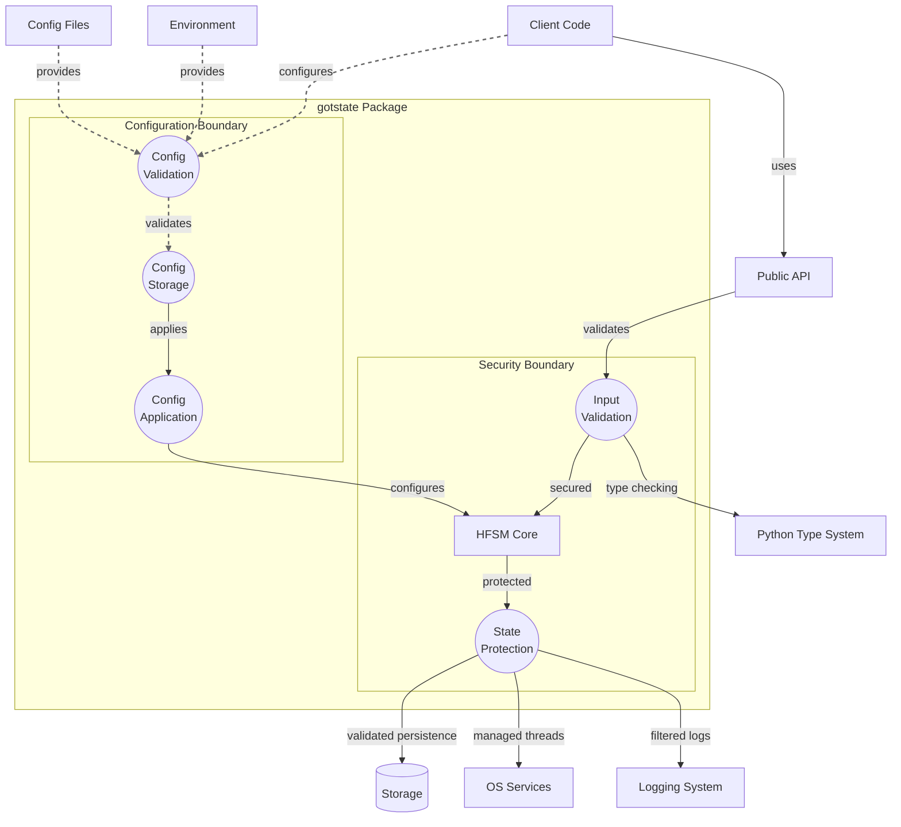

# Package Boundaries and External Interactions

## Configuration Boundaries

The configuration system maintains strict boundaries for security and reliability:

1. Configuration Sources

- Environment variables are validated before use
- Configuration files are validated against schema
- Programmatic configuration is type-checked
- Runtime changes are validated atomically

2. Configuration Storage

- Configurations are immutable once validated
- Changes create new configuration instances
- History of changes is maintained
- Rollback points are preserved

3. Configuration Application

- Changes are applied atomically
- Components are notified of changes
- State is preserved during updates
- Failed changes are rolled back

4. Security Controls

- Configuration values are validated
- Sensitive data is protected
- Access is controlled
- Changes are audited
